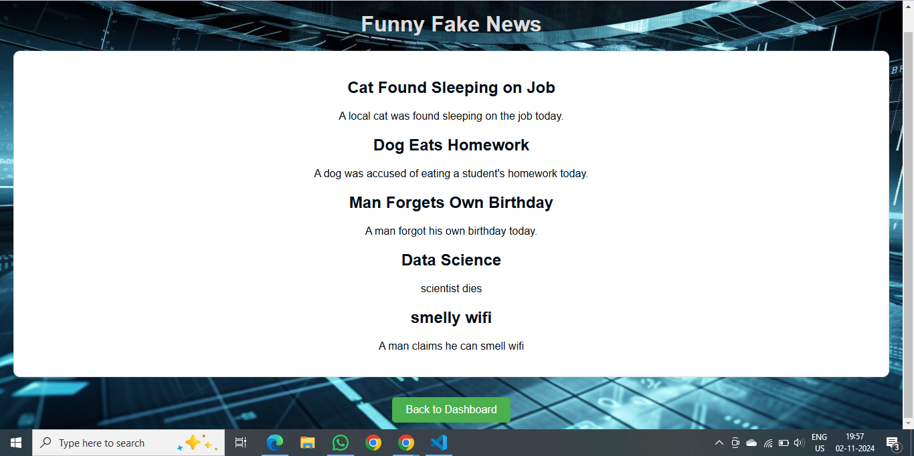

# Fake News Generator 🎯

## Basic Details
### Team Name: BugBashers

### Team Members
- Team Lead: Alan Shaju - Cochin University College of Engineering
- Member 2: P. Sreeram - Cochin University College of Engineering
- Member 3: Priyanshu Praneet - Cochin University College of Engineering

### Project Description
The Fake News Generator project is a JavaScript-based tool that creates realistic yet fictional news articles. It aims to explore content generation techniques and experiment with creative language outputs for educational or entertainment purposes.

### The Problem that doesn't exist
The Fake News Generator solves the "critical" problem of generating sensational and completely fabricated news stories to amuse people who are tired of real-world news.

### The Solution that nobody asked for
By bringing the most wierd and funniest news together!!

## Technical Details
### Technologies/Components Used
For Software:
- [Languages used] : HTML, CSS, Javascript
- [Frameworks used] : React
- [Tools used] : ChatGPT

### Implementation
# Installation
npm install
# Run
node script.js

### Project Documentation
#### Overview
The Fake News Generator is a web-based application designed to create humorous and completely fictional news articles. This project aims to explore the creative possibilities of automated content generation, providing users with an entertaining way to produce absurd headlines and stories without relying on any external APIs.
#### Features
Random Story Generation: Generates a new fake news article each time the user requests it.
Customizable Parameters: Users can choose themes or categories for the generated articles, such as politics, sports, or technology.
User-Friendly Interface: A simple and intuitive web interface allows users to easily generate and view their fake news articles.
Shareable Content: Users can copy or share the generated articles on social media or with friends for a good laugh.
#### Technology Stack
HTML: For structuring the web pages.
CSS: For styling the application and improving the user experience.
JavaScript: For implementing the logic to generate fake news articles and manage user interactions.
Browser Storage: For saving user preferences or previously generated articles, if desired.
#### Conclusion
The Fake News Generator is a fun and lighthearted project that showcases the capabilities of JavaScript in generating creative content. By providing an engaging platform for users to create and share ridiculous news stories, it emphasizes the entertaining side of content generation without the complexities of using external APIs.

# Fake Screenshots

Visually stunning dashboard

Fake news Generator

Homepage

# Fake Diagrams

workflow

### Project Demo
# Video
[Watch the vedio here](https://drive.google.com/drive/folders/1nPGP7Dava5ESd4iGBIfaW3IvWDLXXpf_?usp=sharing)
The demo briefly showcases working of the fake news generator.

## Team Contributions
- Alan Shaju: Implemented the backend logic
- P Sreeram: Implemented visually appealing frontend
- Priyanshu Praneet: Created documentation of the project

---
Made with ❤ at TinkerHub Useless Projects 

